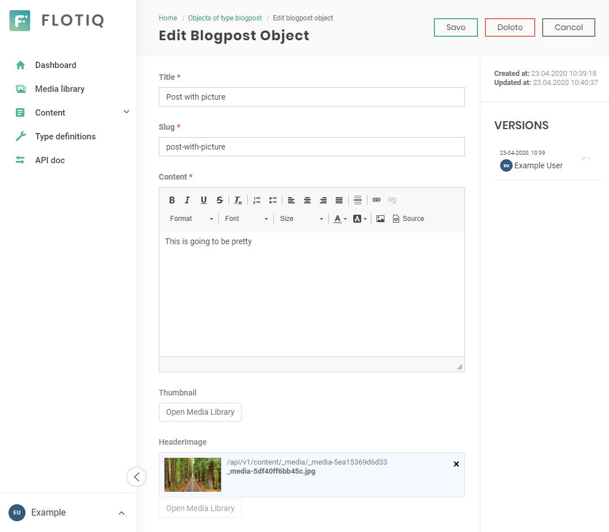

<a href="https://flotiq.com/">
    
</a>

Gatsby Starter - Blog
========================

This is a [Gatsby](https://gatsbyjs.org) starter project for a blog. It's configured to pull blog posts data from [Flotiq](https://flotiq.com) and can be easily deployed to your cloud hosting - Heroku, Netlify, Gatsby Cloud, etc.

Live Demo: https://flotiq-blog.herokuapp.com/

Screenshot


**See how this blog is built and deployed on Heroku:**

[](https://www.youtube.com/watch?v=hz3RK5qqhrQ)


## Quick start

1. **Start project from template using Gatsby CLI**
    
    ```bash
    gatsby new my-blog-starter https://github.com/flotiq/gatsby-starter-blog
    ```
   
1. **Setup "Blog Post" Content Type in Flotiq**

   Create your [Flotiq.com](https://flotiq.com) account. Next, create the `Blog Post` Content Type:

   
    
   _Note: You can also create `Blog Post` using [Flotiq REST API](https://flotiq.com/docs/API/)._ 

1. **Configure application**

    The next step is to configure our application to know from where it has to fetch the data.
       
    You need to create a file called `.env` inside the root of the directory, with the following structure:

    ```
    GATSBY_FLOTIQ_BASE_URL=https://api.flotiq.com
    GATSBY_FLOTIQ_API_KEY=YOUR FLOTIQ API KEY
    ```

1.  **Start developing**

    Navigate into your new site’s directory and start it up.

    ```sh
    cd my-blog-starter/
    npm install
    gatsby develop
    ```
    
    If you wish to import example blog posts to your account, before running `gatsby develop` run:
        
    ```sh
    node ./example/importExample.js
    ```
    
    It will add 1 image and 2 blog posts to your Flotiq account.
    
    _Note: You need to put your Read and write API key in `.env` for import to work. You don't need Blog Post content type in your account. If you already have posts with ids `blogpost-1` and `blogpost-2` they will be overwritten._

1.  **Open the source code and start editing!**
    
    Your site is now running at [http://localhost:8000](http://localhost:8000)!
    
    _Note: You'll also see a second link: _[http://localhost:8000/___graphql](http://localhost:8000/___graphql)`_. This is a tool you can use to experiment with querying your data. Learn more about using this tool in the [Gatsby tutorial](https://www.gatsbyjs.org/tutorial/part-five/#introducing-graphiql)._
    
    Open a project directory in your code editor of choice and edit `src/templates/index.js`. Save your changes and the browser will update in real time!

1. **Manage your posts using Flotiq editor**
      
    You can now easily manage your posts using [Flotiq editor](https://editor.flotiq.com)
    
    

## Deploy

  You can deploy this project to Heroku in 3 minutes:

  [](https://heroku.com/deploy?template=https://github.com/flotiq/gatsby-starter-blog)
  
  Or to Netlify:
  
  [](https://app.netlify.com/start/deploy?repository=https://github.com/flotiq/gatsby-starter-blog)


## Collaborating

   If you wish to to talk with us about this project, feel free to hop on our [discord server](https://discord.gg/FwXcHnX).
   
   If you found a bug, please report it in [issues](https://github.com/flotiq/gatsby-starter-blog/issues).
